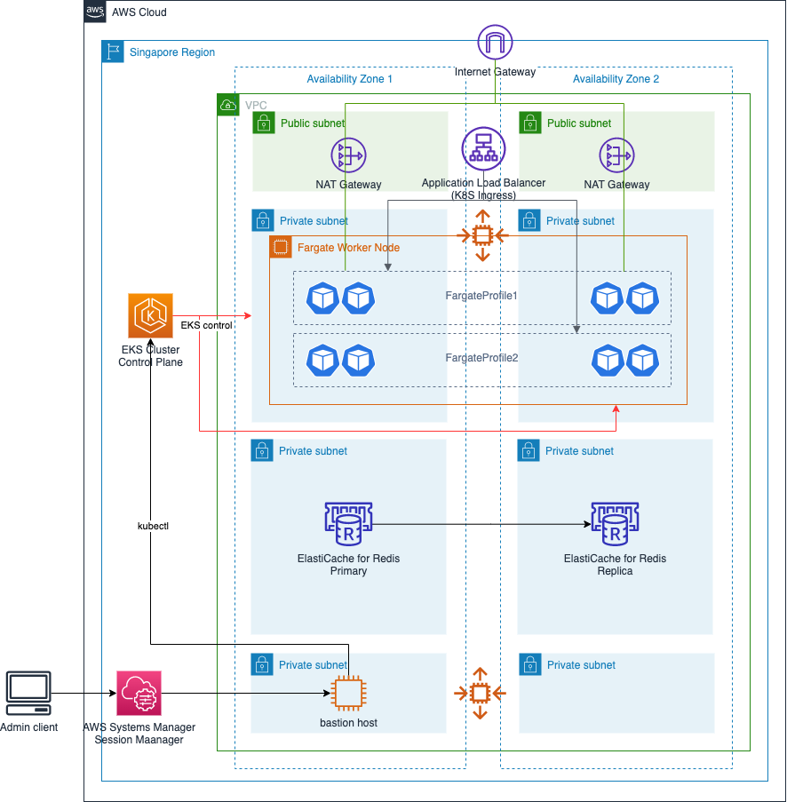

# Welcome to cdk-eks-bastion-redis project

<span style="color:red;">
This project is for reference only. Not for production use.
</span>

This is an example project for CDK development with Python to deploy VPC, EKS, Bastion Host, and Redis cluster.

This project tried to clear up the following uncertainties:

1. How Bastion Host IAM role can assign as a EKS role for control plane access.
2. How to create EKS cluster specifying KubernetesVersion which is not available in CDK library yet
3. How to create Elasticache Redis Cluster with Multi-AZ enabled 

---
## Architecture diagram:



---
## Development Guide
The `cdk.json` file tells the CDK Toolkit how to execute your app.

This project is set up like a standard Python project.  The initialization
process also creates a virtualenv within this project, stored under the `.venv`
directory.  To create the virtualenv it assumes that there is a `python3`
(or `python` for Windows) executable in your path with access to the `venv`
package. If for any reason the automatic creation of the virtualenv fails,
you can create the virtualenv manually.

To manually create a virtualenv on MacOS and Linux:

```
$ python3 -m venv .venv
```

After the init process completes and the virtualenv is created, you can use the following
step to activate your virtualenv.

```
$ source .venv/bin/activate
```

If you are a Windows platform, you would activate the virtualenv like this:

```
% .venv\Scripts\activate.bat
```

Once the virtualenv is activated, you can install the required dependencies.

```
$ pip install -r requirements.txt
```

At this point you can now synthesize the CloudFormation template for this code.

```
$ cdk synth
```

Customize enironemnt variables for cdk deployment.

```
$ export CDK_TARGET_ACCOUNT='12-digit-account-number'
$ export CDK_TARGET_REGION='ap-southeast-1'
```

setup aws credential profile for the target AWS acount
```
$ aws configure --profile cdk-target-profile
```

To setup CDK provisioned resources in your account, CDK Bootstrap is required.
```
$ cdk bootstrap --profile cdk-target-profile
```

To deploy CDK stack
```
$ cdk deploy --profile cdk-target-profile
```

To add additional dependencies, for example other CDK libraries, just add
them to your `setup.py` file and rerun the `pip install -r requirements.txt`
command.

## Useful commands

 * `cdk ls`          list all stacks in the app
 * `cdk synth`       emits the synthesized CloudFormation template
 * `cdk deploy`      deploy this stack to your default AWS account/region
 * `cdk diff`        compare deployed stack with current state
 * `cdk docs`        open CDK documentation

Enjoy!
